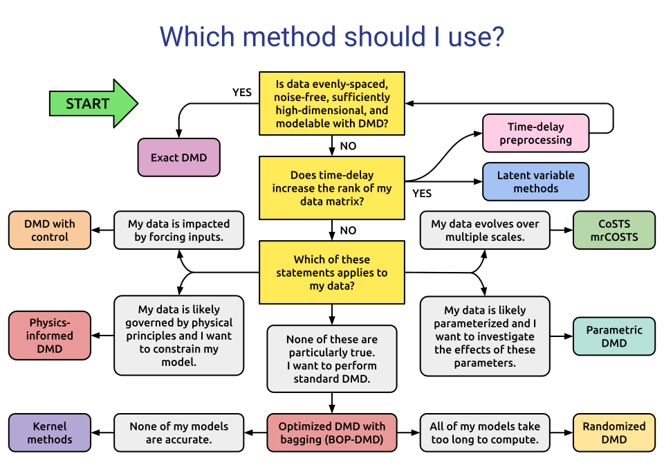

.. _dmd_guide:

DMD Variant Guide
=================

Not sure which DMD variant to use? The flowchart below will help you choose
the most appropriate method based on your data and problem type.

|

Guide to DMD Variants
---------------------

Noise-Robust Methods
^^^^^^^^^^^^^^^^^^^^

Use these when your data contains measurement noise:

- **Forward-Backward DMD** — corrects for sensor noise by combining forward and backward DMD.
- **Total Least-Squares DMD** — de-biases DMD for noisy datasets.
- **Optimal Closed-Form DMD** — low-rank DMD with an exact, tractable solution.
- **Subspace DMD** — stochastic Koopman analysis for noisy data.
- **Physics-Informed DMD** — incorporates known physical constraints.
- **Optimized DMD** — uses variable projection for improved accuracy.
- **BOP-DMD** — adds bagging to Optimized DMD for uncertainty quantification.

Data Compression and Sparsity
^^^^^^^^^^^^^^^^^^^^^^^^^^^^^^

Use these when working with large datasets or seeking sparse representations:

- **Compressed DMD** — reduces computational cost via random projections.
- **Randomized DMD** — efficient DMD for very large datasets.
- **Sparsity-Promoting DMD** — promotes sparse mode selection.

Including Inputs and Control
^^^^^^^^^^^^^^^^^^^^^^^^^^^^^

Use these when your system has external inputs:

- **DMD with Control (DMDc)** — incorporates the effect of control inputs.

Transient and Multiscale Dynamics
^^^^^^^^^^^^^^^^^^^^^^^^^^^^^^^^^^^

Use these for systems with multiple timescales or transient behavior:

- **Multiresolution DMD** — captures dynamics at multiple time scales.
- **Higher Order DMD** — for 1D snapshots or delay-embedded systems.

Parameterized Systems
^^^^^^^^^^^^^^^^^^^^^

Use these when your system depends on parameters:

- **Parametric DMD** — forecasts parametric dynamical systems.

Kernel and Nonlinear Methods
^^^^^^^^^^^^^^^^^^^^^^^^^^^^^

Use these for nonlinear systems:

- **Extended DMD** — kernel-based method for Koopman spectral analysis.
- **LANDO** — kernel learning for robust DMD with nonlinear disambiguation.

Citing PyDMD
------------

When using PyDMD, please cite both of the following:

- Demo, Tezzele, Rozza. *PyDMD: Python Dynamic Mode Decomposition*.
  Journal of Open Source Software, 2018.
  `DOI (Demo 2018) <https://doi.org/10.21105/joss.00530>`_

- Ichinaga, Andreuzzi, Demo, Tezzele, Lapo, Rozza, Brunton, Kutz.
  *PyDMD: A Python Package for Robust Dynamic Mode Decomposition*.
  Journal of Machine Learning Research, 2024.
  `DOI (Ichinaga 2024) <http://jmlr.org/papers/v25/24-0739.html>`_