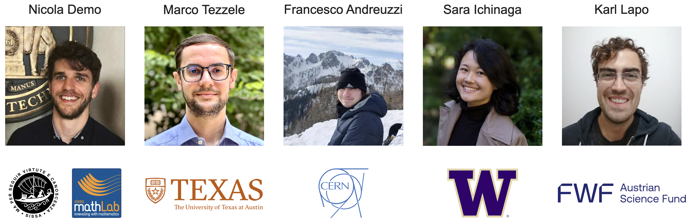
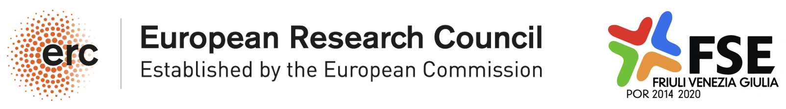
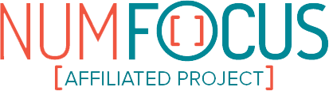

.. PyDMD documentation master file

PyDMD: Python Dynamic Mode Decomposition
=========================================

**Version**: |version| | **Useful links**: `Source Repository <https://github.com/PyDMD/PyDMD>`_ | `Issue Tracker <https://github.com/PyDMD/PyDMD/issues>`_ | `PyPI <https://pypi.org/project/pydmd/>`_

PyDMD is a Python package for **Dynamic Mode Decomposition (DMD)** — a data-driven method for analyzing and extracting spatiotemporal coherent structures from time-varying datasets. It implements both standard DMD and advanced variants, making it suitable for researchers, engineers, and data scientists across many fields.

.. grid:: 2

    .. grid-item-card:: Getting Started

        New to PyDMD? Start here for a quick introduction and installation
        instructions.

        +++

        .. button-ref:: installation
            :ref-type: doc
            :expand:
            :color: secondary
            :click-parent:

            To the installation guide

    .. grid-item-card:: Tutorials

        Step-by-step examples covering all DMD variants available in PyDMD,
        from basic usage to advanced techniques.

        +++

        .. button-ref:: tutorials
            :ref-type: doc
            :expand:
            :color: secondary
            :click-parent:

            To the tutorials

    .. grid-item-card:: API Reference

        Detailed description of all classes, methods, and functions included
        in PyDMD.

        +++

        .. button-ref:: code
            :expand:
            :color: secondary
            :click-parent:

            To the API reference

    .. grid-item-card:: Developer's Guide

        Want to contribute to PyDMD? Learn how to set up your environment,
        write tests, and submit pull requests.

        +++

        .. button-ref:: contributing
            :expand:
            :color: secondary
            :click-parent:

            To the contributor's guide

.. toctree::
    :maxdepth: 1
    :hidden:

    installation
    quickstart
    tutorials
    dmd_guide
    faq
    code
    contributing
    contact
    code_of_conduct
    LICENSE

.. image:: _static/pydmd_capabilities.svg
   :width: 700px
   :align: center

|

Description
-----------
PyDMD is a Python package designed for Dynamic Mode Decomposition (DMD), a data-driven
method used for analyzing and extracting spatiotemporal coherent structures from
time-varying datasets. It provides a comprehensive and user-friendly interface for
performing DMD analysis, making it a valuable tool for researchers, engineers, and data
scientists working in various fields.

With PyDMD, users can easily decompose complex, high-dimensional datasets into a set of
coherent spatial and temporal modes, capturing the underlying dynamics and extracting
important features. The package implements both standard DMD algorithms and advanced
variations, enabling users to choose the most suitable method for their specific needs.

PyDMD offers seamless integration with the scientific Python ecosystem, leveraging
popular libraries such as NumPy and SciPy for efficient numerical computations. It also
offers a variety of visualization tools, including mode reconstruction, energy spectrum
analysis, and time evolution plotting.

Installation
------------

PyDMD can be installed via pip:

.. code-block:: bash

    pip install pydmd

Or clone and install from source:

.. code-block:: bash

    git clone https://github.com/PyDMD/PyDMD
    pip install -e .

References
----------
- Kutz, Brunton, Brunton, Proctor. *Dynamic Mode Decomposition: Data-Driven Modeling of Complex Systems*. SIAM, 2016.
- Gavish, Donoho. *The optimal hard threshold for singular values is 4/sqrt(3)*. IEEE Trans. Information Theory, 2014.
- Hemati, Rowley, Deem, Cattafesta. *De-biasing the dynamic mode decomposition*. Theoretical and Computational Fluid Dynamics, 2017.
- Kutz, Fu, Brunton. *Multiresolution Dynamic Mode Decomposition*. SIAM Journal on Applied Dynamical Systems, 2016.
- Erichson, Brunton, Kutz. *Compressed dynamic mode decomposition for background modeling*. J. Real-Time Image Processing, 2016.
- Le Clainche, Vega. *Higher Order Dynamic Mode Decomposition*. SIAM Journal on Applied Dynamical Systems, 2017.

Developers and Contributors
---------------------------

The main developers are:

|

We warmly thank all contributors who have supported PyDMD! Do you want
to join the team? Read the :doc:`contributing` guidelines before starting.

Funding
-------

PyDMD has been supported by the H2020 ERC CoG 2015 AROMA-CFD project 681447
(P.I. Gianluigi Rozza), and the FSE HEaD project Bulbous Bow Shape Optimization
through Reduced Order Modelling. We are grateful for all project and
university-funded contributions that have advanced this package.

Affiliations
------------

Indices and tables
------------------

* :ref:`genindex`
* :ref:`modindex`
* :ref:`search`