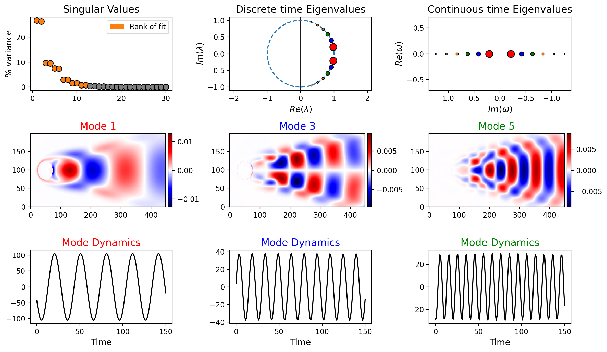

.. _quickstart:

Quickstart Guide
================

This guide provides a brief introduction to using PyDMD. For more detailed
examples, see the :doc:`tutorials` page.

Basic Usage
-----------

To perform DMD, initialize a PyDMD module, fit it to your data using the
``fit()`` method, and then use PyDMD's plotting tools to visualize results.

.. code-block:: python

    from pydmd import DMD
    from pydmd.plotter import plot_summary

    # Build an exact DMD model with 12 spatiotemporal modes.
    dmd = DMD(svd_rank=12)

    # Fit the DMD model.
    # X = (n, m) numpy array of time-varying snapshot data.
    dmd.fit(X)

    # Plot a summary of the key spatiotemporal modes.
    plot_summary(dmd)

|

*Sample output of the* ``plot_summary`` *function on flow past a cylinder data.*

Using Preprocessors
-------------------

PyDMD modules can be wrapped with data preprocessors that automatically
preprocess input data and postprocess reconstructions.

.. code-block:: python

    from pydmd import DMD
    from pydmd.preprocessing import zero_mean_preprocessing

    # Build and fit an exact DMD model with data centering.
    centered_dmd = zero_mean_preprocessing(DMD(svd_rank=12))
    centered_dmd.fit(X)

Advanced Usage: BOP-DMD
-----------------------

PyDMD supports highly customized DMD models. Below is an example of a
Bagging, Optimized DMD (BOP-DMD) model with eigenvalue constraints and
custom variable projection arguments.

.. code-block:: python

    from pydmd import BOPDMD

    bopdmd = BOPDMD(
        svd_rank=12,
        num_trials=100,
        trial_size=0.5,
        eig_constraints={"imag", "conjugate_pairs"},
        varpro_opts_dict={"tol": 0.2, "verbose": True},
    )

    # X = (n, m) numpy array of time-varying snapshot data
    # t = (m,) numpy array of times of data collection
    bopdmd.fit(X, t)

Customizing plot_summary
------------------------

The ``plot_summary()`` function accepts many parameters for customization:

.. code-block:: python

    from pydmd.plotter import plot_summary

    plot_summary(
        dmd,
        figsize=(12, 7),
        index_modes=(0, 2, 4),
        snapshots_shape=(449, 199),
        order="F",
        mode_cmap="seismic",
        dynamics_color="k",
        flip_continuous_axes=True,
        max_sval_plot=30,
    )

For full documentation of all parameters, see the
`Plotter documentation <code.html>`_.

Next Steps
----------

- Browse the :doc:`tutorials` for step-by-step examples
- Check the :doc:`dmd_guide` to find the best DMD variant for your problem
- See the full :doc:`code` for API details